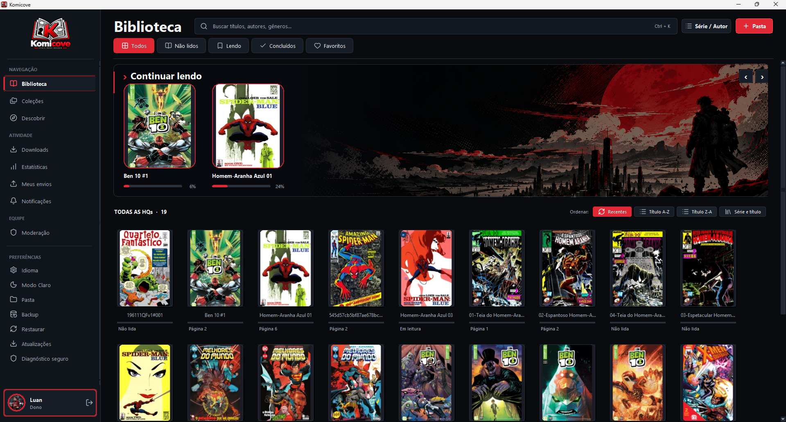
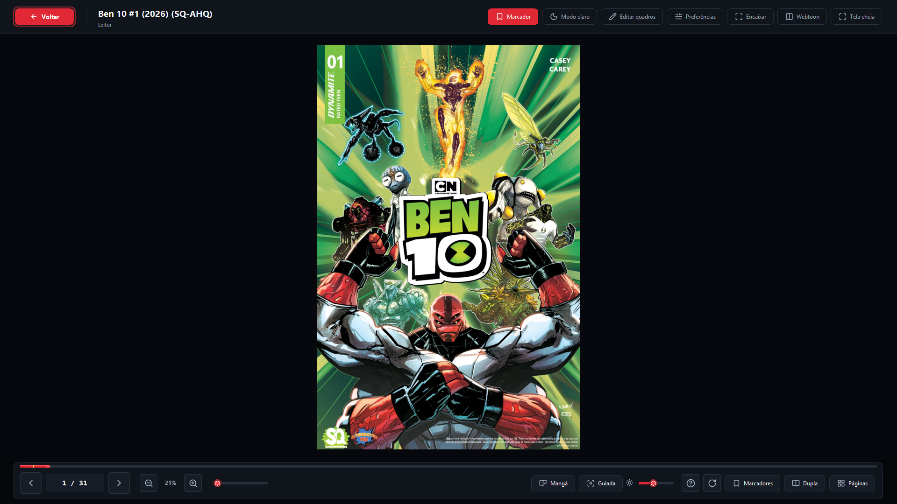
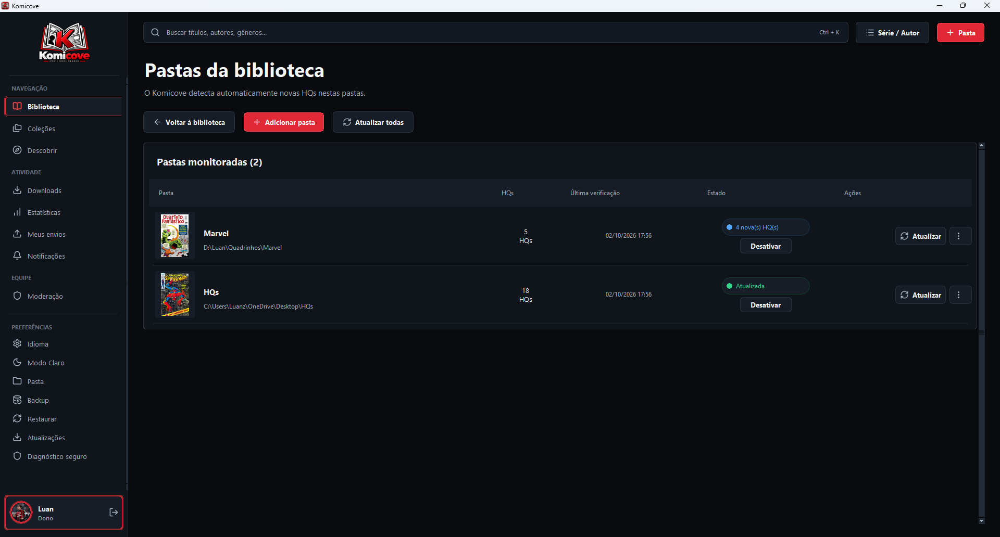
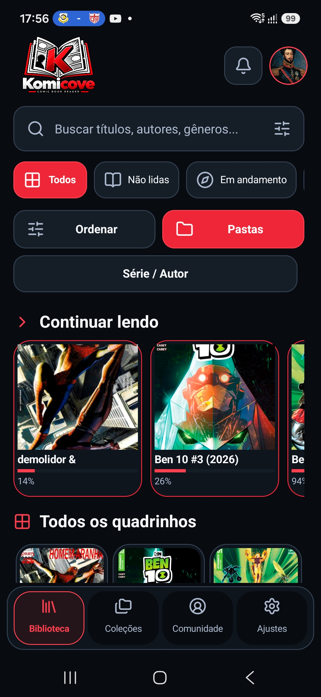
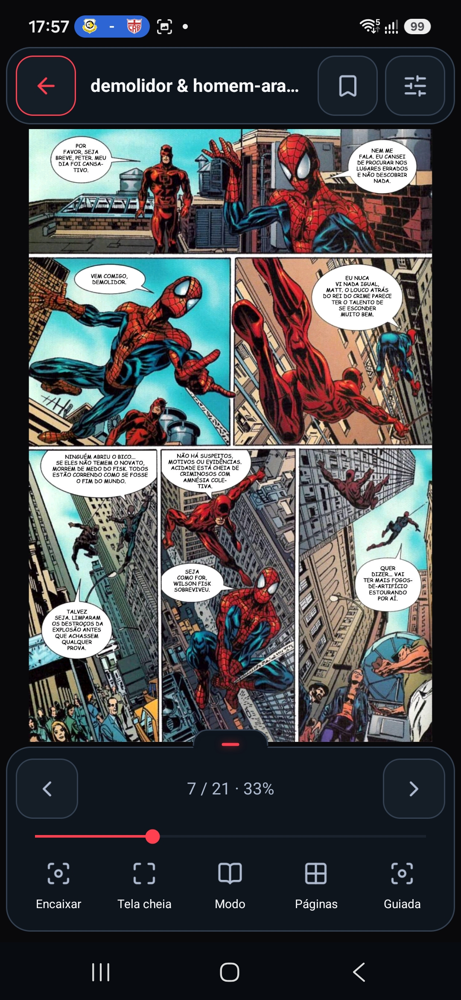
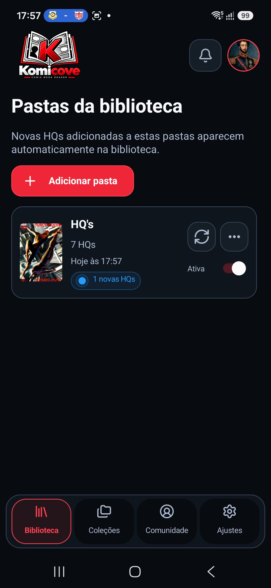

  

# Komicove · Comic Book Reader

[English](README.md) · **Português**

A free, open-source comic book reader for Windows, Linux, and Android. Organize your collection, track your progress, and read your local files with no account and no internet connection.

**Windows 0.2.0 · Android 0.2.0 · Linux 0.2.0 · MIT License**

[Website](https://lucrazy-fn.github.io/PANEL-ComicBookReader/) · [Downloads](https://github.com/lucrazy-fn/PANEL-ComicBookReader/releases) · [Issues](https://github.com/lucrazy-fn/PANEL-ComicBookReader/issues)

> Work in progress. The features described here match the current code; older versions may not include them.

## Early update: 0.2.0

Since updates were taking longer than I would like, I decided to release the improvements that were already ready instead of waiting for all the planned changes. Development continues, and more features, tweaks, and fixes are coming in future versions.

### What's new compared to 0.1.0

- Redesigned interface on desktop and Android, with consistent icons, rounded corners, and a subtle glow.
- Revised account, profile, and reader options screens.
- **Android:** collapsible reader controls, freeing up more room for the page.
- **Android:** improvements to loading compressed files, caching, memory usage, and reusing the comic's preparation when rotating the device.
- Watched folders with persistent registration, detection of new comics, and manual refresh.
- Option to enable or disable folders, hiding their comics without deleting progress.
- Duplicates are silently ignored, with a summary at the end of each import.
- Removed files become unavailable without losing reading data; moves and renames are handled when they can be identified.
- Fixes for scrolling and for preserving the library position when using **Show more**.

Automatic detection works while the app is in use or when you return to the library. There is no permanent monitoring while the app is closed.

## Take a look at the interface

These are just a few screenshots of Komicove. The app has other screens and features beyond those shown here.

### Desktop

Library with search, filters, progress, and quick access to your next reads.

  

See the reader and watched folders on desktop

#### Reader

#### Watched folders

### Android

Library, reader, and folder management in the native mobile interface.

<table>
  <tr><th>Library</th><th>Reader</th><th>Watched folders</th></tr>
  <tr>
    <td></td>
    <td></td>
    <td></td>
  </tr>
</table>

The screenshots show the app in use. The comics displayed belong to their respective owners and are not distributed with Komicove.

## 📢 PANEL is now Komicove

**Since version 0.1.0, PANEL is called Komicove.**

When I started the project, I chose the name **PANEL** without knowing that another comic reader with a very similar name already existed. I wasn't aware of that app before creating and publishing PANEL.

Now that I've discovered the similarity and the project is growing, I decided to change the name to give it a more distinct identity and avoid possible confusion in the future.

Komicove is still the same open-source project, with the same development and goals. Existing data and accounts remain accessible; earlier versions remain available under the PANEL name.

Thank you to everyone who has been following, testing, and supporting the project so far! ❤️

**PANEL → Komicove**

## Getting started

- **Windows 10/11:** download the installer from the Releases page. You don't need to install Python to use the app.
- **Linux x86_64:** a portable package (`.tar.gz`) and an experimental Flatpak are available. Check availability on the Releases page. Compatibility may vary between distributions.
- **Android 8 or higher:** download the APK from the same page.

Also tested on **Debian 13** in a WSL2 environment. The portable Linux package in this update was built with glibc 2.41; compatibility with older distributions may vary.

Back up your data before updating. On Android, the APK must be signed with a key compatible with the existing installation; do not uninstall the app to work around incompatibilities without first protecting your data.

On Windows, enter guest mode and select the folder containing your comics. On Android, add files or a folder using the device's picker. Files in the folder stay in their original location; the app uses a temporary copy while the comic is open. Comics already imported in earlier versions remain in the library.

The first time you open the new desktop version, local data from the old `Panel` folder is copied to `Komicove`. The old folder remains as a backup and is not deleted automatically.

## Features

- Library with covers, search, favorites, saved progress, and alphanumeric ordering on Android.
- Collections to organize your library, with multi-comic selection on Android.
- Reader with zoom, bookmarks, double-page mode, manga mode, and vertical reading.
- Preferences for zoom persistence and automatic fit.
- Experimental guided reading on Windows and Android.
- Navigation and return-to-library buttons with enlarged click areas.
- Watched folders with manual refresh and the option to enable or disable them.

### Experimental guided reading

Enable it in **Reader preferences**. The arrow keys step through the detected panels. On Windows, press **L** to turn the feature on or off.

When detection doesn't recognize the page's divisions, the reader uses approximate, overlapping segments, labeled **Segment**. Pages with diagonal or overlapping panels, or colored borders, may not be recognized correctly.

## Formats

| Format | Windows/Linux | Android |
| --- | --- | --- |
| CBZ / ZIP | Supported | Supported |
| Image-based EPUB | Experimental support | Experimental support |
| PDF | Supported | Supported |
| CBR / RAR | 7-Zip or a compatible tool | Supported |
| 7Z / CB7 / TAR / CBT | Requires 7-Zip installed separately | Supported |

Compressed archives must contain image pages, including inside folders. Android includes RAR5 support. Password-protected files are not supported.

## Contributing to Komicove

Suggestions, bug reports, accessibility improvements, translations, and code contributions are welcome.

1. Check existing Issues before opening a new one.
2. For larger changes, describe your proposal in an Issue before implementing it.
3. Fork the repository and create a branch for your change.
4. Make a focused change and test the affected behavior.
5. Open a pull request explaining the problem, the solution, and how you tested it. For visual changes, include screenshots.

## Found a problem?

Open an [Issue](https://github.com/lucrazy-fn/PANEL-ComicBookReader/issues) with the Komicove version, your operating system, the steps to reproduce, and the expected result. If possible, include the error message or a screenshot.

For guided reading failures, include the page and whether the counter showed **Panel** or **Segment**. Do not share passwords, tokens, or comic files without authorization.

## License

Komicove is released under the [MIT license](LICENSE). Dependencies retain their own licenses.
